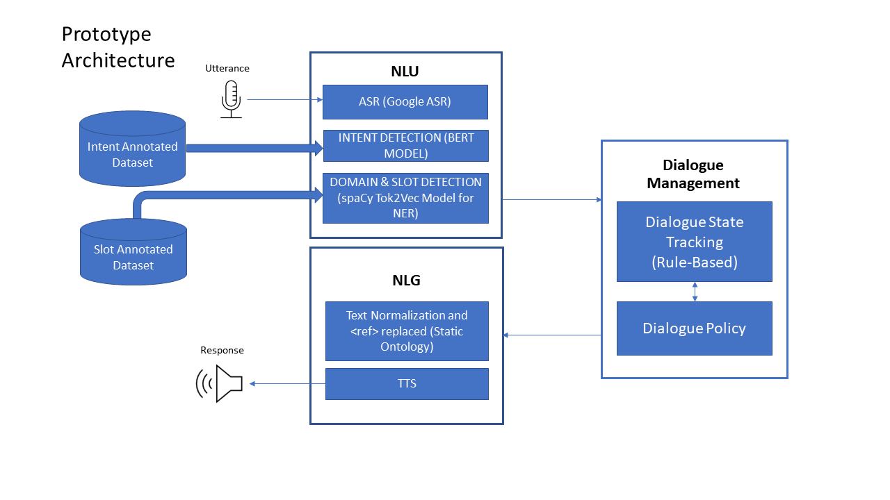

# Subway Voice Assistant

It is a Voice Assistant that will aid one to make an order on Subway food ordering website. It is a Task Oriented Dialogue System that do the task assigned to it and in this case it will be ordering food from subway. 

This project is still at the Prototype stage. 

[Here is the link to the colab project](https://github.com/nvasu001/Voice-Assistant-for-Subway-Food-Ordering/blob/main/Voice_Assistant_for_Ordering_Food_on_Subway.ipynb)

## Table of Contents
- [File from the repo to be used along with the code](#File-from-the-repo-to-be-used-along-with-the-code)
- [Architecture of the Prototype](#Prototype-Architecture)
- [Modules](#Modules)
    - [Natural Language Understanding (NLU)](#NLU)
        - [Automatic Speech Recognition (ASR)](#ASR)
        - [Intent Detector](#Intent-Detector)
        - [Slot Detector](#Slot-Detector)
    - [Dialogue Management (DM)](#DM)
        - [Dialogue Policy (DP)](#DP)
        - [Dialogue State Tracking (DST)](#DST)
    - [Natural Language Generation (NLG)](#NLG)
    - [Integrated Voice Assistant](#Integrated-VA)
 - [References](#References)


## File from the repo to be used along with the code

1. Dataset containing files (train.csv,test.csv,valid.csv) required to train the __Bert model__ for the intent Detection 
2. base_config.cfg - _it is a configuration file for spaCy NER using __Tok2Vec__ which uses CPU and it is optimized for ACCURACY_
3. dialogue_policy.csv 
4. slot_annotated_utterances.csv - _it is the slot and entity annotation dataset for spaCy NER_
5. requirements.txt - _it has all the dependencies for this python project_
```!pip install -r requirements.txt```

You do not have to upload these files into the ___VoiceAssistantforSubway.ipynb___ colab file. Executing the __!wget__ line will upload them into the colab instance.

## Prototype Architecture



## Modules

### NLU
    
The NLU in a TOD is used to extract the user's goal from the utterance. 

#### ASR
    
For the ASR we have used the GoogleColabAudio ___[5]___ to set up the mic which saves the audio recording in ```audio.wav``` as colab runs in a remote server and does not have access to the built in microphone of the local machine. We have also used the Speech to Text ___[7]___ as the ASR along with the recorder.

The output of the ASR is ```user_input``` which is a string type.

#### Intent Detector

The intent detector in a TOD extracts the command/action context from the user's utterance based off which a response can be chosen.

There are 6 intents:
    1. Select (used in the prototype)
    2. Deselect (used in the prototype)
    3. Greetings (used in the prototype)
    4. Agree
    5. Disagree
    6. Instead
    
The ```sentences``` variable stores the utterances from ```user_input``` in the NLU and ```text``` stores the ```sentences``` as string type.
The predicted intent is stored in ```classes[label]``` which is the output of the Intent Detector module.

The annotated datasets used to train the model this module are [test](https://github.com/nvasu001/CS-733-Voice-Assistant-for-Food-Ordering/blob/main/test.csv), [train](https://github.com/nvasu001/CS-733-Voice-Assistant-for-Food-Ordering/blob/main/train.csv) and [validation](https://github.com/nvasu001/CS-733-Voice-Assistant-for-Food-Ordering/blob/main/valid.csv).
    
#### Slot Detector

For the slot detector we have used spaCy's ___[2]___ NER and we have fine tuned it for our need. We have used Tok2Vec model that uses CPU which is opimized for accuracy in this prototype. Using transformers can yeild better accuracy in the predictions and one can create the necessary configuration file for it using ___[3]___.
    
The slot detector detects the __entities__ which are the items that are chosen by the user to act on such as _italian artisan bread_, _cucumbers_ and _peppercorn ranch_ and the __slots__ which are the item's type such as bread, veggies and sauce. 

The ```ent.text``` is the entity and the ```ent.label_``` is the slot which are the outputs of the slot detector.

The annotated dataset used to train the model for this module is [here](https://github.com/nvasu001/CS-733-Voice-Assistant-for-Food-Ordering/blob/main/slot_annotated_utterances.json).
    
### DM
    
The dialogue management is where the conversation is tracked and the appropriate response choices and agent actions are decided. 
    
#### DP

For the Dialogue Policy we have used dialogue_policy.csv to implement it. It is in the form of a pandas dataframe ```df```.
    
#### DST 

For the prototype we have used python scripting to decide how to make the coverstation with the user. A Dialogue turn is created here for each and every command.

### NLG 

In thi prototype, For the NLG we normalize the entities (Text Normalization) uttered by the user using a python dictionary ```official_name```. We replace the <ref> tags with the normalized words. Then we pass on the response to a Text to speech ___[8]___ so the user can hear it. 

### Integrated VA

This module is where one executes the voice assistant. It will record the voice and create and audio.wav file which will be used by the ASR to convert speech into text.

Once you execute the Integrated VA, it will immediately start recording your command and once you stop the recording, it will give a response to your command.
      
## References
1.  https://colab.research.google.com/github/PradipNichite/Youtube-Tutorials/blob/main/Spacy_Custom_NER_Youtube.ipynb#scrollTo=enIOTr8y6hf9
2.  https://github.com/amrrs/custom-ner-with-spacy3/blob/main/Custom_NER_with_Spacy3.ipynb
3.  https://spacy.io/usage/training#config-overrides
4.  https://tecoholic.github.io/ner-annotator/
5.  https://pypi.org/project/GoogleAudio/
6.  https://www.researchgate.net/publication/358429149_Speech_to_text_in_python Sundiman, Didi. (2022). Speech to text in python.
7.  https://pypi.org/project/SpeechRecognition/
8.  https://github.com/mammothtraining/Super-Simple-Text-to-Speech-with-Python-and-Google-Colab/blob/main/01%20Convert%20text%20to%20speech%20with%20gTTS.ipynb
9.  https://www.youtube.com/watch?v=ngYRYMoIGu8&ab_channel=MammothInteractive
10.  https://github.com/curiousily/Deep-Learning-For-Hackers/blob/master/18.intent-recognition-with-BERT.ipynb
11. https://curiousily.com/posts/intent-recognition-with-bert-using-keras-and-tensorflow-2/
